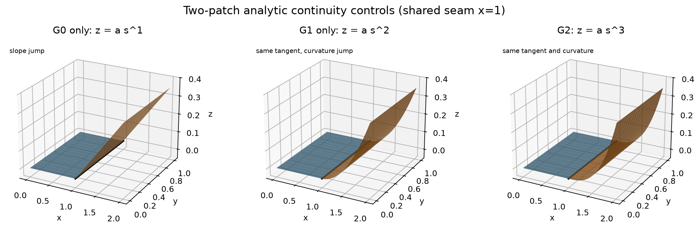

# Text2CAD-GC

**A geometric-continuity benchmark and reinforcement-learning toolkit for Text-to-CAD**  
**面向 Text-to-CAD 的 G0/G1/G2 几何连续性评测与强化学习工具包**

[](LICENSE)
[](data/pilot/README.md)
[](docs/ground_truth.md)

中文 | [English](#english)

---

## 中文

Text2CAD-GC 是一个面向 **Text-to-CAD、精确 B-Rep/NURBS 生成和强化学习**的开放实验项目。它解决一个常被整体 Chamfer Distance、渲染图和 watertight 指标掩盖的问题：生成的相邻曲面在共享接缝上是否真正达到位置连续 G0、切平面连续 G1 或曲率连续 G2。

本仓库目前提供可复现的 pilot，而不是宣称已经建成论文级大规模 benchmark：

- 90 个带解析真值的双曲面 STEP，G0/G1/G2 各 30 个；
- 固定的 train/validation/test 划分：60/15/15；
- 基于 Open CASCADE 的逐接缝 G0/G1/G2 分析器；
- 可用于 PPO、GRPO 或 verifier-guided RL 的分层 reward；
- 3,691 条 PartABC 接缝的去标识派生指标，不重新分发受限原始 CAD；
- Text-to-CAD benchmark 选型和真实数据集建设说明。



### 为什么需要它

一个生成模型可能拥有很低的点云距离，甚至能够网格化，但相邻 NURBS faces 仍可能没有共享拓扑、存在位置缝隙、法向折痕或曲率跳变。现有 Text-to-CAD benchmark 主要测整体形状、代码执行、尺寸、拓扑、watertight 或 VLM 偏好；这些指标不能替代逐接缝的微分几何检查。

### 数学真值

Pilot 数据中的两片曲面为：

\[
S_1(u,v)=(Lu,Wv,0), \qquad
S_2(s,t)=(L(1+s),Wt,As+Bs^2+Cs^3).
\]

它们在 `u=1`、`s=0` 共享接缝：

- `A ≠ 0`：只达到 G0，位置相接但切平面不同；
- `A = 0, B ≠ 0`：达到 G1，但曲率存在跳变；
- `A = 0, B = 0, C ≠ 0`：达到 G2。

因此标签来自解析式和 CAD kernel 复核，不来自人眼或语言模型猜测。

### 数据

| 数据 | 数量 | 用途 | 是否可直接作为论文最终测试集 |
|---|---:|---|---:|
| Analytic pilot STEP | 90 | evaluator 校准、RL curriculum、回归测试 | 否，几何族较简单 |
| Analytic controls | 3 | G0/G1/G2 最小真值检查 | 否，单元测试用途 |
| PartABC derived seam metrics | 3,691 seams / 249 models with analyzable seams | 真实 CAD 分布审计、迁移管线 | 否，来自 test convenience scan 且缺 design intent |

90 个 pilot 样本和标签见 [`data/pilot`](data/pilot/README.md)。可用 Excel 打开的清单位于 [`manifest_readable.csv`](data/pilot/manifest_readable.csv)。

### 安装

推荐使用 Conda：

```bash
conda env create -f environment.yml
conda activate text2cad-gc
```

### 快速运行

分析一个 STEP：

```bash
python scripts/analyze_step_continuity.py data/controls/two_patch_G2.step
```

计算以 G2 为目标的强化学习奖励：

```bash
python scripts/rl_continuity_reward.py \
  data/controls/two_patch_G2.step G2 --mode at_least
```

重新生成 90 个 pilot STEP：

```bash
python scripts/build_rl_continuity_dataset.py
```

本地校验中，以 G2 为目标时，G0-only、G1-only、G2 candidate 的 reward 分别为 `0.36`、`0.600006`、`1.0`。

### 推荐的论文评测组合

Text2CAD-GC 不应替代所有现有 benchmark。建议同时使用：

1. NURBGen/PartABC official test：整体几何、IR 和 baseline 可比性；
2. CADTestBench：文本中的尺寸、拓扑和实体要求；
3. MUSE 或 CADGenBench：工程质量、制造、装配或 STEP validity；
4. Text2CAD-GC：指定接缝的 G0/G1/G2。

详细说明见 [`docs/benchmark-guide-zh.md`](docs/benchmark-guide-zh.md)。

### 强化学习时的正确用法

连续性 reward 必须与 validity、prompt compliance、dimension、topology 和 sharp-edge preservation 联合使用。只奖励 G2 会产生 reward hacking：模型可能减少曲面数量、消除接缝，或把本应锐利的机械边错误地磨平。

论文级真实训练集应从 ABC/PartABC **training split** 提取，并人工补充：

- 目标接缝的空间或语义定位；
- `intent = sharp / smooth`；
- `required_grade = G0 / G1 / G2`；
- 文本描述和尺寸/拓扑约束。

所有派生变体必须按原始 CAD model ID 分组划分，避免训练/测试泄漏。

### 作者

**Fang Zheng**  
Doctor of Artificial Intelligence  
The Hong Kong Polytechnic University (PolyU)

### 引用

如果本项目对你的研究有帮助，请使用仓库中的 [`CITATION.cff`](CITATION.cff)。项目仍处于 research preview；引用时请注明版本或 commit hash。

---

## English

Text2CAD-GC is an open experimental project for **Text-to-CAD, exact B-Rep/NURBS generation, and reinforcement learning**. It evaluates a question that is often hidden by global Chamfer distance, rendered images, or watertightness: do adjacent generated surfaces actually achieve positional G0, tangent-plane G1, or curvature G2 continuity across their shared seam?

The current release is a reproducible pilot rather than a paper-scale benchmark. It includes:

- 90 analytic two-patch STEP models with exact labels: 30 each for G0, G1, and G2;
- a fixed 60/15/15 train/validation/test split;
- an Open CASCADE seam-level continuity evaluator;
- a shaped reward for PPO, GRPO, or verifier-guided reinforcement learning;
- 3,691 de-identified derived seam measurements from a PartABC audit, without redistributing restricted source CAD;
- guidance for combining continuity evaluation with existing Text-to-CAD benchmarks.

### Why this project

A generated model can have a low point-cloud distance and even mesh successfully while adjacent NURBS faces lack shared topology, contain positional gaps, show normal creases, or exhibit curvature jumps. Existing Text-to-CAD benchmarks mainly measure global shape, code execution, dimensions, topology, watertightness, or VLM preference. These metrics do not replace differential checks across shared seams.

### Analytic ground truth

The pilot uses two patches:

\[
S_1(u,v)=(Lu,Wv,0), \qquad
S_2(s,t)=(L(1+s),Wt,As+Bs^2+Cs^3).
\]

They share the seam at `u=1` and `s=0`:

- `A ≠ 0`: G0 only;
- `A = 0, B ≠ 0`: G1 but not G2;
- `A = 0, B = 0, C ≠ 0`: G2.

Labels therefore come from analytic construction and CAD-kernel verification rather than visual or language-model judgment.

### Quick start

```bash
conda env create -f environment.yml
conda activate text2cad-gc

python scripts/analyze_step_continuity.py data/controls/two_patch_G2.step
python scripts/rl_continuity_reward.py \
  data/controls/two_patch_G2.step G2 --mode at_least
```

For a G2 target, the verified shaped rewards are `0.36` for a G0-only candidate, `0.600006` for a G1-only candidate, and `1.0` for a G2 candidate.

### Intended benchmark stack

Text2CAD-GC is designed to complement existing evaluation:

1. NURBGen/PartABC official test for global geometry, invalidity, and baseline comparability;
2. CADTestBench for executable prompt constraints;
3. MUSE or CADGenBench for engineering quality and validity;
4. Text2CAD-GC for seam-level G0/G1/G2 requirements.

### RL use and limitations

Continuity reward must be combined with validity, prompt compliance, dimensions, topology, and sharp-edge preservation. A G2-only objective can be gamed by eliminating seams or smoothing edges that should remain sharp.

The 90-model pilot is intended for evaluator calibration and early RL curricula. A publication-grade real-part dataset should be built from a disjoint ABC/PartABC training split, manually annotate seam design intent, and split all derived variants by original CAD model ID.

### Author

**Fang Zheng**  
Doctor of Artificial Intelligence  
The Hong Kong Polytechnic University (PolyU)

### Citation

Please cite the repository through [`CITATION.cff`](CITATION.cff) and include the release version or commit hash. This repository is currently a research preview.

## Acknowledgements

The evaluator uses [Open CASCADE Technology](https://dev.opencascade.org/). The derived audit statistics reference PartABC/NURBGen data; original gated CAD files are not redistributed. Please follow the licenses and access terms of every upstream dataset and benchmark.
